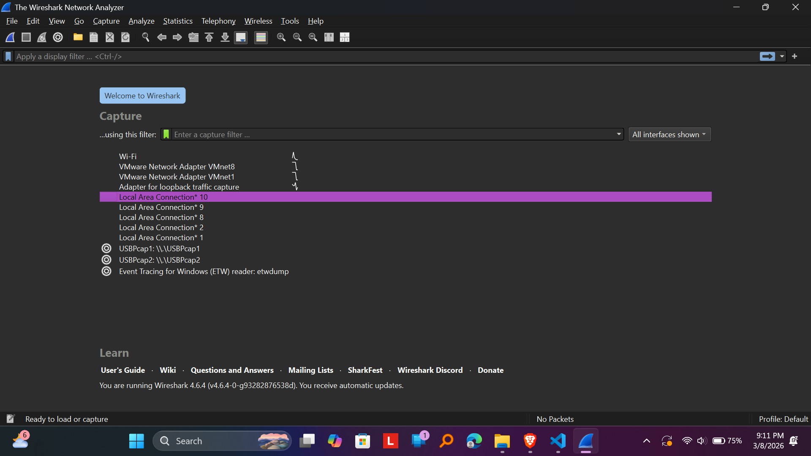

# Laporan Praktikum Jarkom IF-04-05

## Tujuan Praktikum
menginstall wireshark 

## langkah - langkah praktikum 
1. install python 
2. install wireshark 
3. run wireshark

## ss perobaan
hasil run wireshark
