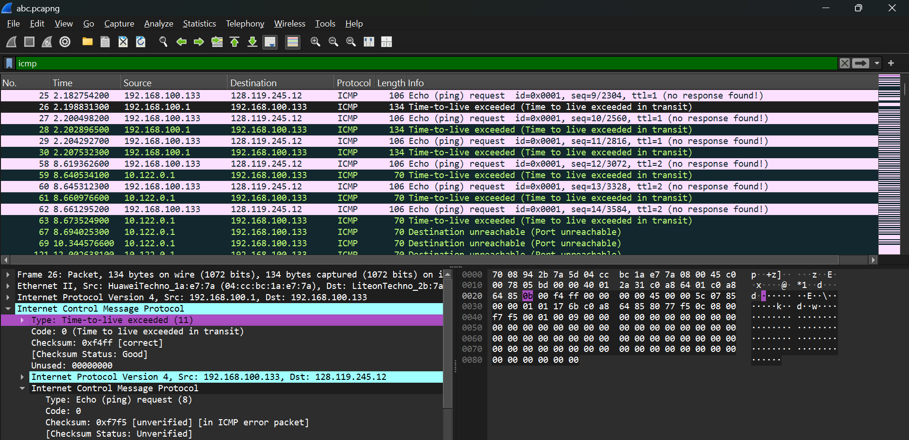
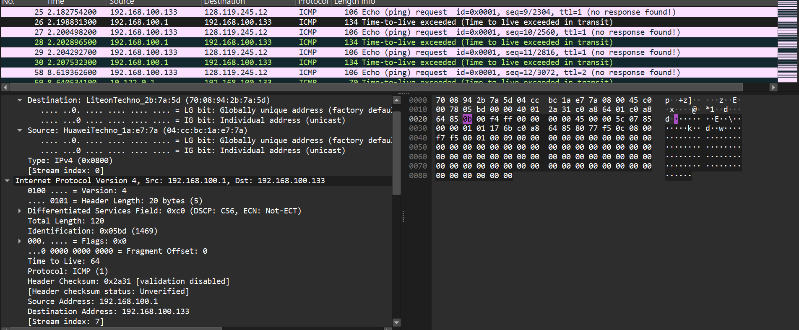
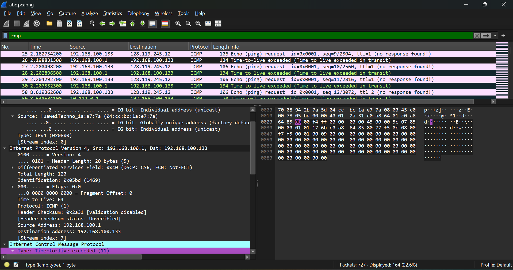
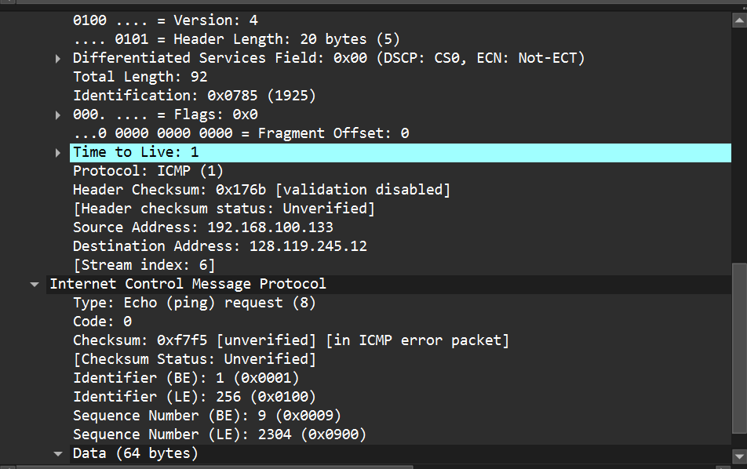
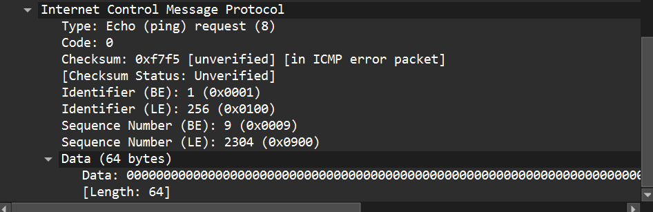
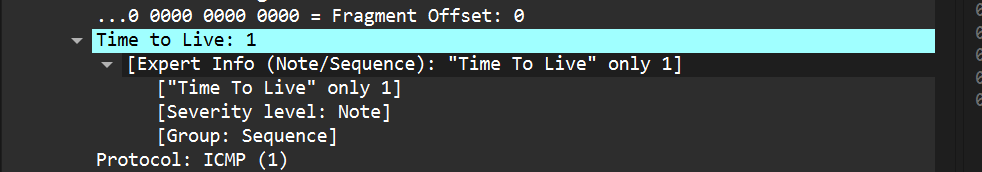

## tujuan praktikum 
Mahasiswa dapat menginvestigasi cara kerja protokol IP menggunakan Wireshark

## langkah - langkah 
1. install filenya 
2. openfilenya dengan wireshark 

## step by step dan screenshot 

# 1. apa itu ip address 
IP Address adalah alamat logis yang digunakan untuk mengidentifikasi perangkat dalam jaringan komputer. Setiap perangkat yang terhubung ke jaringan membutuhkan IP Address agar dapat saling mengirim dan menerima data. IP Address bekerja pada layer jaringan atau network layer.

# 2. traceroute dari suatu website  

traceroute bekerja dengan menaikan nilai TLL secara bertahap untuk mengetahui jalur router

# 3. ICMP, TTL, MTU

  

 

ICMP terlihat di paket Echo request dan TTL exceeded

echo request dikirim komputer 192.168.100.133 -> 128.119.245.12

TTL atau Time To Live adalah nilai pada header IP yang berfungsi untuk membatasi jumlah router yang dapat dilewati oleh paket.
Pada screenshot terlihat nilai Time to Live: 1, yang berarti paket hanya dapat melewati satu router.
Ketika TTL menjadi 0, router membuang paket tersebut dan mengirim pesan ICMP Time-to-live exceeded. 
Sementara itu, MTU adalah ukuran maksimum paket yang dapat dikirim melalui jaringan tanpa harus dipecah. Pada screenshot terlihat Total Length: 92 bytes dan Fragment Offset: 0, sehingga paket tersebut masih kecil dan tidak mengalami fragmentasi.

# 4. (ngak ada waktu lol)
# 6 (ngak ada waktu)
