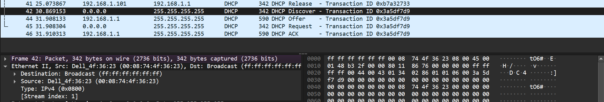
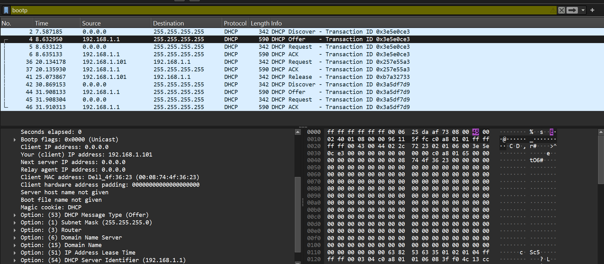
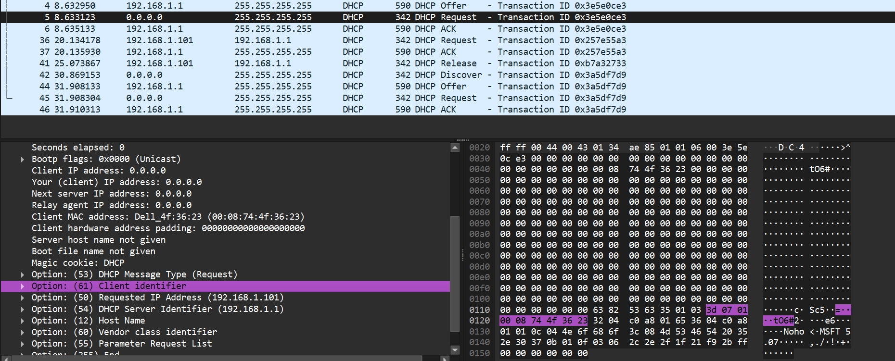
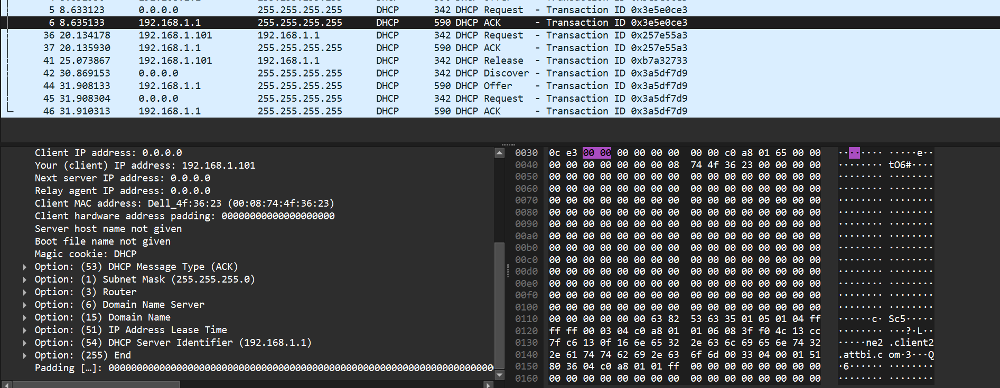

### tujuan praktikum 
Tujuan praktikum ini adalah untuk memahami cara kerja protokol DHCP menggunakan Wireshark.

## Langkah-langkah
1. download filenya (dhcp-ethereal-trace dan zipnya)
2. run di wireshark 

## pertanyaan / soal 
1. apa itu DHCP
2. Plus Minus
3. DORA

### step by step dan screenshot 

## 1. Apa itu DHCP
DHCP atau Dynamic Host Configuration Protocol adalah protokol jaringan yang digunakan untuk memberikan konfigurasi IP secara otomatis kepada perangkat yang terhubung ke jaringan. Konfigurasi yang diberikan oleh DHCP tidak hanya berupa alamat IP, tetapi juga dapat mencakup subnet mask, default gateway, DNS server, dan waktu peminjaman alamat IP atau lease time.

Tanpa DHCP, setiap perangkat harus dikonfigurasi secara manual oleh pengguna atau administrator jaringan. Hal ini akan cukup merepotkan, terutama pada jaringan yang memiliki banyak perangkat seperti jaringan kampus, kantor, laboratorium, atau jaringan rumah dengan banyak device. Dengan adanya DHCP, client cukup terhubung ke jaringan, lalu secara otomatis akan meminta konfigurasi IP dari DHCP server.

## 2. plus minus DHCP

# plus DHCP
1. DHCP memudahkan konfigurasi jaringan karena alamat IP dapat diberikan secara otomatis tanpa harus diatur satu per satu pada setiap perangkat.
2. DHCP dapat mengurangi kemungkinan terjadinya kesalahan konfigurasi IP
3. DHCP fleksibel untuk jaringan yang sering berubah 

# kekurangan DHCP
1. DHCP terlalu bergantung kepada servernya, jika server mengalami gangguan client baru tidak bisa mendapatkan alamat ip
2. DHCP server ywng psldu bisa memberikan konfigurasi jaringan yang salah ke client
3. Alamat ip yang berubah, menyulitkan terhadap perangkat yang membutuhkan IP yang tetap (printer, server, DLL)

## 3. DORA DHCP
dalam DHCP ada 4 proses utama, yaitu:
1. Discover
2. Offer 
3. Request 
4. acknowlegment

# DHCP discover
Pada tahap ini Client belum memiliki alamat ip, untuk mencari DHCP server Client mengirim pesan broadcast ke jaringan, Client memakai 
alamat 0.0.0.0, dan alamat tujuan merupakan 255.255.255.255

# DHCP Offer
Setelah Broadcast DHCP server menerima pesan dari client, Server menawarkan alamat IP kepada client, karena itu pesannya berisi alamat ip yang ditawarkan dan konfigurasi jaringan

# DHCP Request 
setelah Ditawar, client menyetujui or meminta alamat ip yang telah ditawarkan oleh DHCP server, client mengirim request untuk menyetujui alamat ip 

client meminta ip 192.168.1.101

# DHCP ACK
DHCP mengkonfirmasi alamat ip yang diminta client boleh digunakan, setelah acknowledge client dapat menggunakan ip tersebut 

server menyetujui penggunaan alamat ip, dan proses dora selesai 

# kesimpulan    
berdasarkan pengamatan dari wireshark, DHCP tidak hanya memberikan alamat ip, tapi juga configurasi jaringan lain agat cliet dapat terhubung ke internet 

