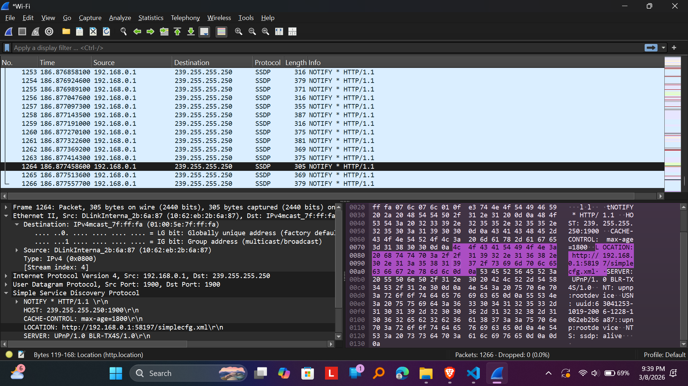

## tujuan praktikum jarkom
1. mengatahui tools
2. mengetahui tool wifi

# langkah-langkah praktimum
1. open wireshark
2. hover ke tulisan wifi di wireshark
3. left-click mouse 2 kali
4. go to browser 
5. masukan url di browsernya (ingat harus yang http)
6. after load url dan muncul ucapan selamat... di browsernya 
7. kembali ke wireshark dan left click "stop capturing" packet dekat top left corner
8. di "apply a..." ketik http, ini membuat wireshark hanya menampilkan http
9. klik http yang berasal dari url tsb itu akan menampilkan pesan dari http (aku males nulis seterusnya)
10. keluar dari wireshark

# ss praktikum 
setelah left click wifi

