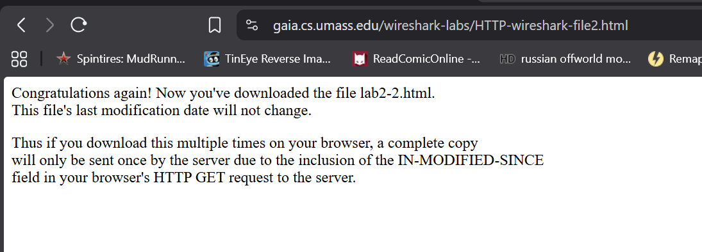
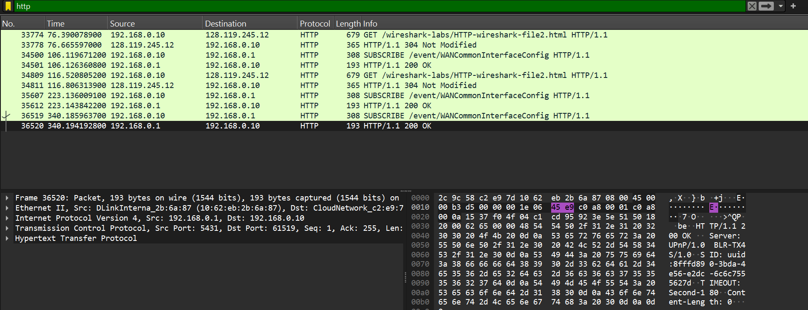
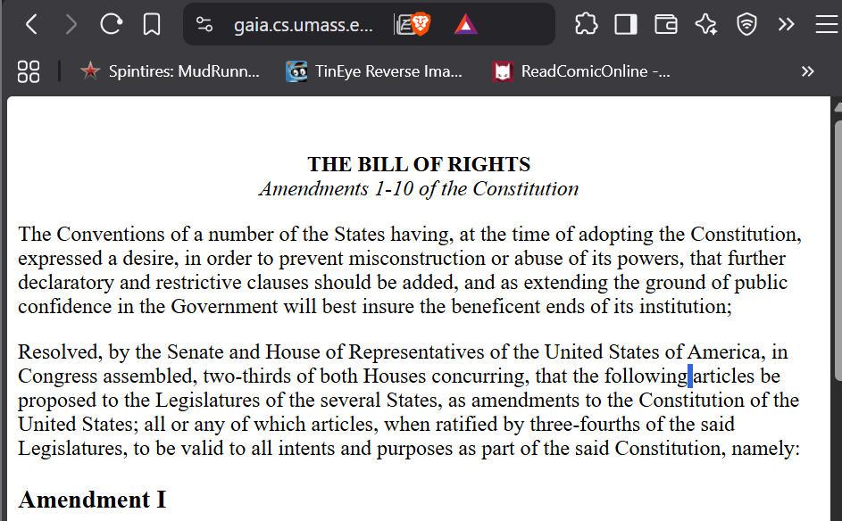
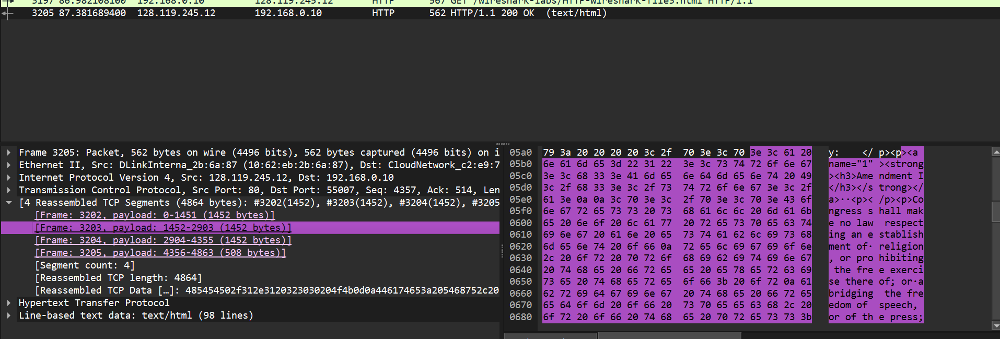
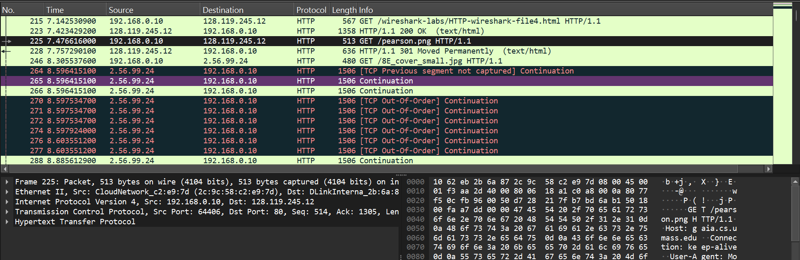
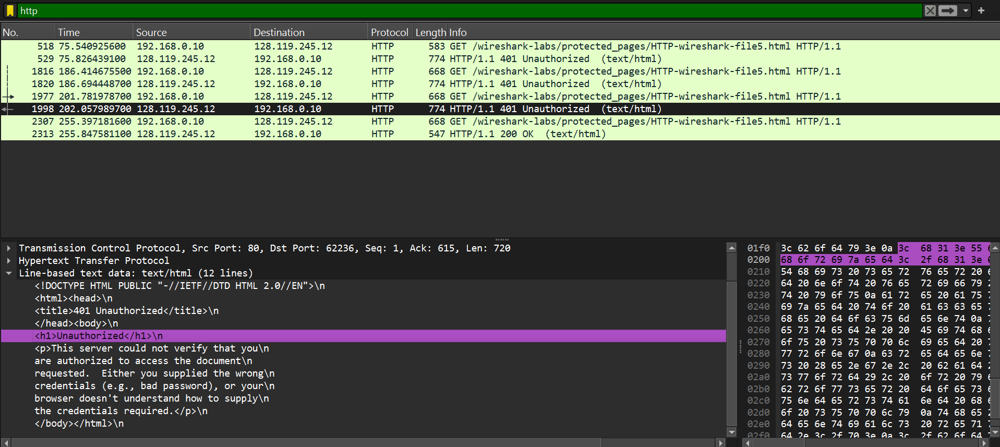
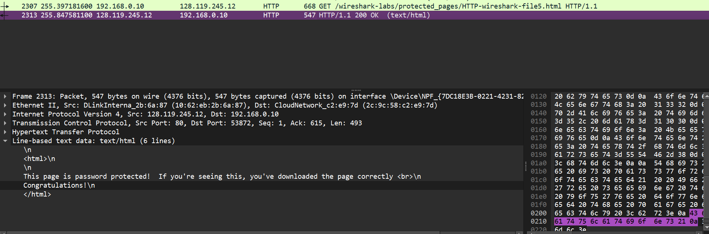

## tujuan praktikum
untuk mempelajari protokol yang sedang berjalan (the basic GET/responese interaction (interaksi dasar
GET/response), HTTP message formats (format pesan HTTP), retrieving large HTML files (mengambil
file HTML besar), retrieving HTML file with embedded objects (mengambil file HTML dengan objek
yang disematkan), serta HTTP authentication and security (autentikasi dan keamanan HTTP).)

## langkah-langkah praktikum 
 # 3.2 dan 3.2.1
 1. buka wireshark 
 2. ke wifi dan record wifinya 
 3. buka website http bukan https
 
 4. kembali ke wireshark dan stop record wifinya
 5. cek di search barnya http dan temukan lenght info yang ada oknya 
 

 # 3.3
 1. buka browser 
 2. masukan linknya
 
 3. kembali ke wireshark dan cari httpnya 
 4. tunjukan tcp fragmentnya
 

 # 3.4 
 1. sama dengan 3.3 tapi harus mencari http gambarnya
 2. masukan linknya 
 3. dan cari http png nya
 

 # 3.5 
 1. Masuk ke websitenya 
 2. masukan passwordnya salah or benar 
 3. kalau gagal akan keluar
 
 4. sedangkan kalau benar akan keluar
 
 
 

