## tujuan praktikum modul 9
## 9.5 dan 9.6
1. memahami cara kerja web server sederhana menggunakan TCP socket programming memakai python 
2. menerima request HTTP dari browser
3. menampilkan file HTML

## 9.5 
1. Langkah pertama 
membuat folder wik9
membuat file server.py
dan membuat index.html

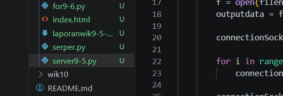

2. langkah kedua 
di file server.py import socket module dan threading

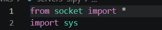

setelah itu buat socket server 

menggunakan ipv4, koneksi TCP

3. langkah 3 bind server to port

menggunakan port 6789

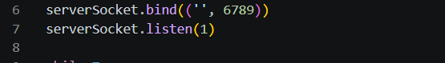

4. langkah 4 menerima request dari client 

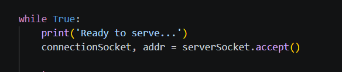

koneksi di terima melalui accept(), karena di terima server membuat socket baru bernama Connectionsocket

5. langkah 5 membaca request HTTP

request dibaca oleh server

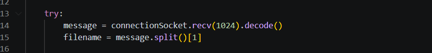

untuk mengambil nama file yang diminta oleh client browser (yang minta browsernya)

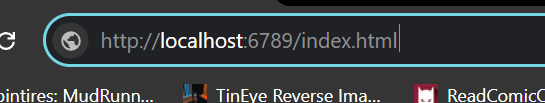

namanya berisi 

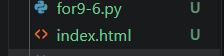

6. membuka dan membaca file HTML

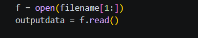

if file ditemukan file dibaca dan disimpan di outputdata

7. respon ok

saat file berhasil ditemukan,header http dikirim

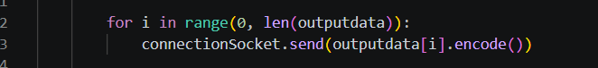

kemudian isi file Html dikirim ke Browser

after semua dikirim, koneksi di cut

8. menangani file yang tidak ditemukan 

if file tak ditemukan akan ke 

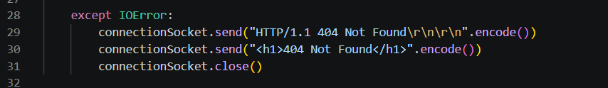

untuk ngirim pesan error not found ke browser   

## sama maaf ngak output tugas soalnya laptop matot selama 2 minggu . jangan pakai browser brave karena parsing error

## 9.6
# step 1 

Buat struktur file nya seperti ini 

1[Struktur folder server multithreaded dengan folder wik9 sebagai tempat file HTML.](../assets/image/wik9.1.1.png)

# step 2 

Buka file for9-6.py di VS Code. Pastikan kode sudah menggunakan:

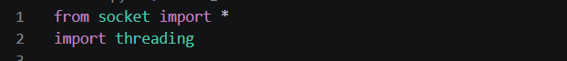

dan memiliki 

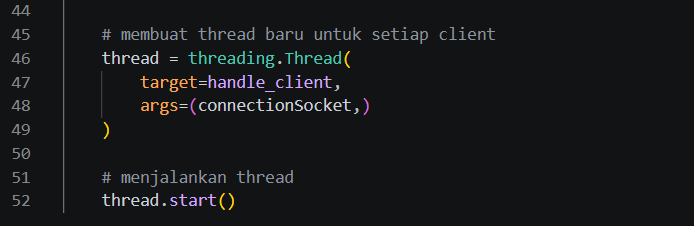

menggunakan module threading 

# step 3 

jalankan file dengan (ctrl) + (f5) dan pilih python debugger? 

server berhasil dijalankan 

# step 4

buka browser (JANGAN PAKAI BRAVE KARENA PARSING ERROR) dan masukan http://localhost:6789/index.html 

menampilkan apa yang ada di Index.html 

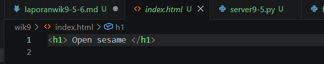

# step 5 

membuktikan kalau bisa untuk banyak orang 

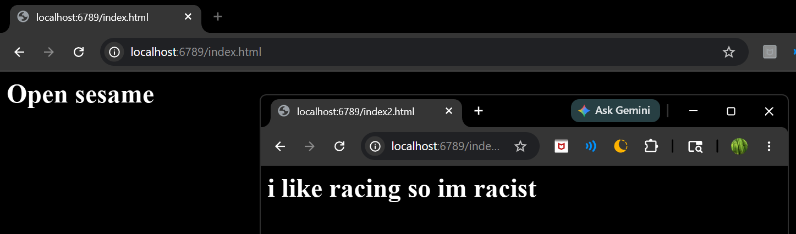

Server multithreaded dapat melayani lebih dari satu request client.

# step 6 

mengecek apakah bisa menunjukan pecarian error jika tidak ditemukan

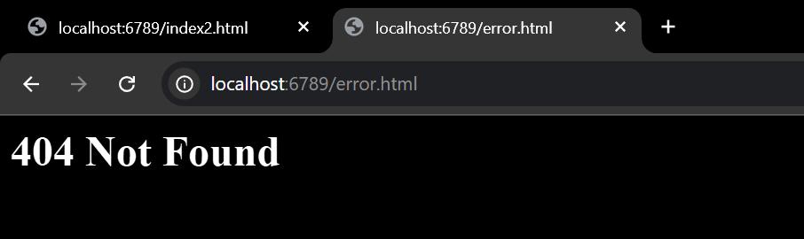

Server menampilkan 404 Not Found ketika file yang diminta client tidak tersedia.

## kesimpulan 

Dari praktikum ini dapat disimpulkan bahwa web server sederhana dapat dibuat menggunakan TCP socket programming pada Python. Server bekerja dengan menerima request HTTP dari client, membaca file yang diminta, lalu mengirimkan response HTTP beserta isi file ke browser. Jika file tidak ditemukan, server akan mengirimkan response 404 Not Found.

